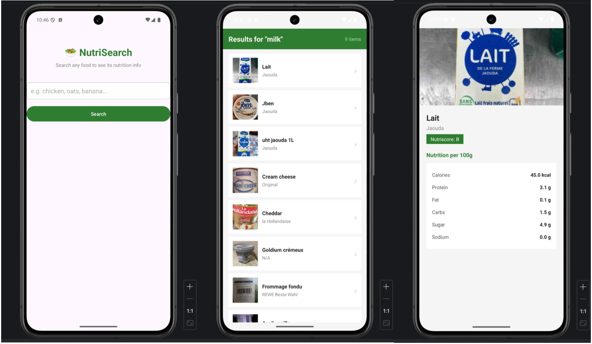
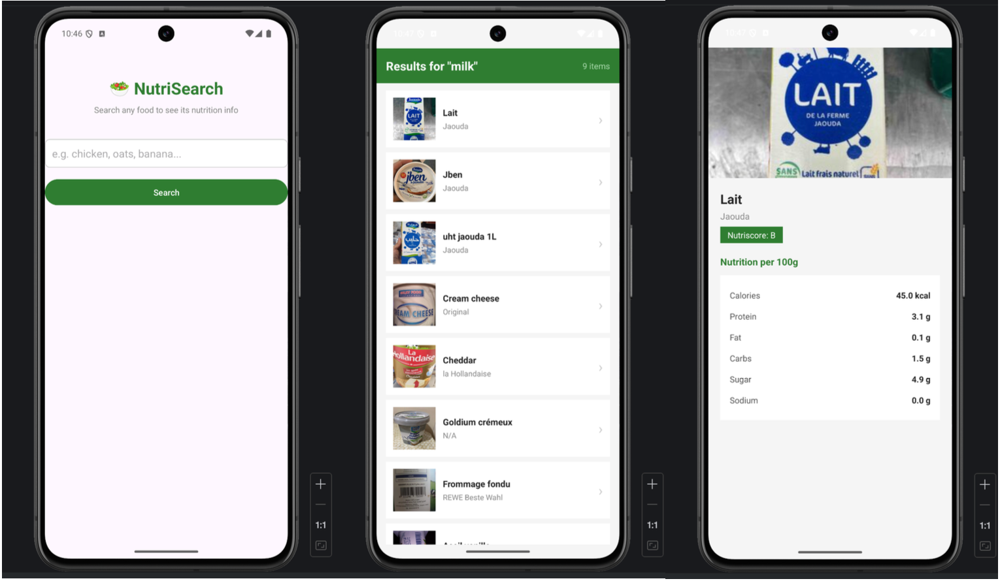

# 🥗 NutriSearch

A full-stack nutrition lookup app. Search any food by name, get back a clean list of matching products with brand, Nutriscore, and per-100g macros — all powered by the Open Food Facts database. Every search is logged to MongoDB and surfaced in a live analytics dashboard.

---

## How It Works

```
Android App
  └─ user types "oat milk"
       │
       │  GET /api/search?q=oat+milk
       ▼
Web Service  (Java · Tomcat · GitHub Codespaces)
  ├─ FoodSearchServlet
  │    ├─ calls Open Food Facts API
  │    ├─ strips response to only what the app needs
  │    └─ logs request metadata to MongoDB Atlas
  │
  └─ DashboardServlet → index.jsp
       └─ analytics + request logs in a browser UI
```

---

## Stack

| Layer | Tech |
|---|---|
| Mobile | Android (Java), RecyclerView, Glide |
| Web Service | Java 16, Jakarta Servlet API, Tomcat 10 |
| Data Source | [Open Food Facts API](https://world.openfoodfacts.org/) — free, no key |
| Database | MongoDB Atlas |
| Build | Maven (web service) · Gradle (Android) |
| Hosting | GitHub Codespaces (Docker) |

---

## Screenshots





---

## Android App

Three-screen flow: **search → results list → nutrition detail**.

- `MainActivity` — single `EditText` + search button
- `ResultsActivity` — fires a background `ExecutorService` thread to call the web service, renders results in a `RecyclerView` via `FoodAdapter`; Glide handles image loading and caching
- `DetailActivity` — shows the product photo, Nutriscore grade, and a labelled table of six macros (calories, protein, fat, carbs, sugar, sodium) all per 100 g

---

## Web Service

Two servlets, no framework overhead.

**`GET /api/search?q=<term>`** — the mobile-facing endpoint

```json
{
  "query": "oat milk",
  "count": 8,
  "results": [
    {
      "name": "Oat Milk Original",
      "brand": "Oatly",
      "nutriscore": "B",
      "image_url": "https://...",
      "calories_100g": 46.0,
      "protein_100g": 1.0,
      "fat_100g": 1.5,
      "carbs_100g": 6.5,
      "sugar_100g": 4.0,
      "sodium_100g": 0.1
    }
  ]
}
```

The `OpenFoodFactsClient` trims the raw Open Food Facts response down to exactly those fields before sending anything to the app. It retries up to 5× with linear back-off on HTTP 503.

**`GET /dashboard`** — browser analytics UI (see below)

---

## MongoDB Logging

Every mobile request writes one document to the `logs` collection:

| Field | What it captures |
|---|---|
| `timestamp` | ISO-8601 UTC instant |
| `query` | Search term |
| `clientIp` | Caller IP |
| `responseStatus` | HTTP status sent back to the app |
| `resultCount` | Number of products returned |
| `durationMs` | Full round-trip time from request in to response out |

`MongoDBClient` is a lazy singleton — one connection for the lifetime of the container.

---

## Analytics Dashboard

Accessible at `/dashboard`. Pulls from MongoDB on each page load.

**Summary cards**
- Top search query of all time
- Average response time over the last 24 hours
- Overall error rate (% non-200 responses)

**Tables**
- Top 5 most searched terms with counts
- Last 50 requests — timestamp, query, IP, status (colour-coded), result count, duration

---

## Running Locally

```bash
# Build the WAR
cd web-service
./mvnw clean package

# Copy and start via Docker
cp target/ROOT.war ../ROOT.war
cd ..
docker build -t nutrisearch .
docker run -d -p 8080:8080 nutrisearch
# → http://localhost:8080/dashboard
```

The Dockerfile is a single-stage Tomcat 10 image:

```dockerfile
FROM tomcat:10.1.0-M5-jdk16-openjdk-slim-bullseye
COPY ROOT.war /usr/local/tomcat/webapps/
```

---

## Project Structure

```
├── android-app/
│   └── app/src/main/java/ds/edu/cmu/nutrisearch/
│       ├── MainActivity.java
│       ├── ResultsActivity.java
│       ├── DetailActivity.java
│       ├── FoodAdapter.java
│       └── FoodItem.java
├── web-service/
│   └── src/main/
│       ├── java/
│       │   ├── FoodSearchServlet.java
│       │   ├── DashboardServlet.java
│       │   ├── OpenFoodFactsClient.java
│       │   ├── MongoDBClient.java
│       │   └── LogEntry.java
│       └── webapp/
│           ├── index.jsp
│           ├── css/dashboard.css
│           └── WEB-INF/web.xml
├── Dockerfile
├── build-and-run.sh
└── ROOT.war
```
